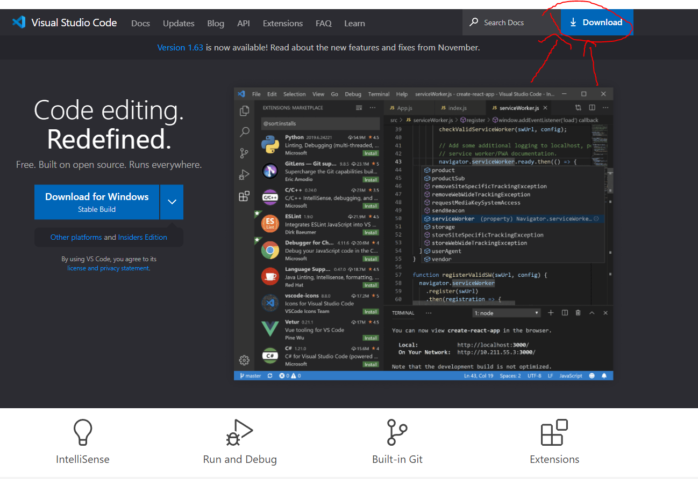

# Lab report

## Installing VScode

* Go to [VS Code Official Site](https://code.visualstudio.com)
* Click on the blue download button at the top right

* This will lead you to the dowload page, choose you OS.
* Double click the .exe file.

## Remotely Connecting 
---
### Installing OpenSSH
* You can do so by following the [guide](https://docs.microsoft.com/en-us/windows-server/administration/openssh/openssh_install_firstuse) along.
* Start by checking if OpenSSH is already installed
* Open Powershell as the administrator and run the following command:
```
Get-WindowsCapability -Online | Where-Object Name -like 'OpenSSH*'
```
* If it is not installed, this should be the output:
```
Name  : OpenSSH.Client~~~~0.0.1.0
State : NotPresent

Name  : OpenSSH.Server~~~~0.0.1.0
State : NotPresent
```
* Run the followings commands to download the Client or Server depending on which one was not present
```
# Install the OpenSSH Client
Add-WindowsCapability -Online -Name OpenSSH.Client~~~~0.0.1.0

# Install the OpenSSH Server
Add-WindowsCapability -Online -Name OpenSSH.Server~~~~0.0.1.0
```
* After this, the first command should output this:
```
Name  : OpenSSH.Client~~~~0.0.1.0
State : Installed

Name  : OpenSSH.Server~~~~0.0.1.0
State : Installed
```
---
### Finding your course specific account
* https://sdacs.ucsd.edu/~icc/index.php


## Trying Some Commands
## Moving Files with scp
## Setting an SSH Key
## Optimizing Remote Running
