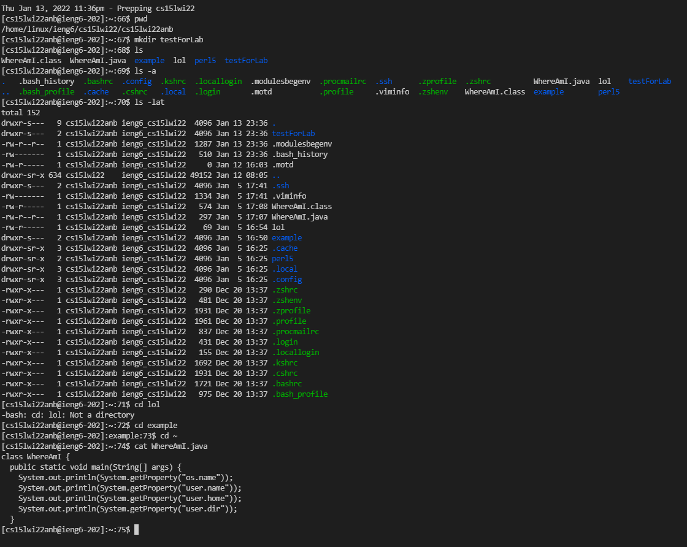

 <font size="12"> Lab Report Week 1 and 2</font>

**Table of Contents:**
- [Installing VScode](#installing-vscode)
- [Remotely Connecting](#remotely-connecting)
  - [Installing OpenSSH](#installing-openssh)
  - [Finding your course specific account](#finding-your-course-specific-account)
  - [Connecting](#connecting)
- [Trying Some Commands](#trying-some-commands)
- [Moving Files with scp](#moving-files-with-scp)
- [Setting an SSH Key](#setting-an-ssh-key)
  - [Creating key:](#creating-key)
  - [Extra step for Windows Computer:](#extra-step-for-windows-computer)
  - [Adding key to computer and remote host:](#adding-key-to-computer-and-remote-host)
- [Optimizing Remote Running](#optimizing-remote-running)

# Installing VScode

* Go to [VS Code Official Site](https://code.visualstudio.com)
* Click on the blue download button at the top right

* This will lead you to the dowload page, choose you OS.
* Double click the .exe file.

# Remotely Connecting 

## Installing OpenSSH
* You can do so by following the [guide](https://docs.microsoft.com/en-us/windows-server/administration/openssh/openssh_install_firstuse) along.
* Start by checking if OpenSSH is already installed
* Open Powershell as the administrator and run the following command:

```
Get-WindowsCapability -Online | Where-Object Name -like 'OpenSSH*'
```

* If it is not installed, this should be the output:

```
Name  : OpenSSH.Client~~~~0.0.1.0
State : NotPresent

Name  : OpenSSH.Server~~~~0.0.1.0
State : NotPresent
```

* Run the followings commands to download the Client or Server depending on which one was not present

```
# Install the OpenSSH Client
Add-WindowsCapability -Online -Name OpenSSH.Client~~~~0.0.1.0

# Install the OpenSSH Server
Add-WindowsCapability -Online -Name OpenSSH.Server~~~~0.0.1.0
```

* After this, the first command should output this:

```
Name  : OpenSSH.Client~~~~0.0.1.0
State : Installed

Name  : OpenSSH.Server~~~~0.0.1.0
State : Installed
```


## Finding your course specific account
* Got to https://sdacs.ucsd.edu/~icc/index.php
* The page should look like this, input your username and  Student ID

* Here you can find your username and set your password. For this class it will look something like this: cs15lwi22***@ieng6.ucsd.edu
* The stars will be your own custom letters.


## Connecting
* Open Visual Studio and hover over Terminal and click New Terminal
* Paste the following command but replacing the stars with your own letters.

```
$ ssh cs15lwi22***@ieng6.ucsd.edu
```

* As it is the first time logging in you will receive the following message. Just type yes then hit enter.

```
The authenticity of host 'ieng6.ucsd.edu (128.54.70.227)' can't be established.
RSA key fingerprint is SHA256:ksruYwhnYH+sySHnHAtLUHngrPEyZTDl/1x99wUQcec.
Are you sure you want to continue connecting (yes/no/[fingerprint])? 
```

* It will then ask you for your password, type in the one you got above. You will not see it appear as you type.

``` 
Password: 
Last login: Sun Jan  2 14:03:05 2022 from 107-217-10-235.lightspeed.sndgca.sbcglobal.net
quota: No filesystem specified.
Hello cs15lwi22zz, you are currently logged into ieng6-203.ucsd.edu

You are using 0% CPU on this system

Cluster Status 
Hostname     Time    #Users  Load  Averages  
ieng6-201   23:25:01   0  0.08,  0.17,  0.11
ieng6-202   23:25:01   1  0.09,  0.15,  0.11
ieng6-203   23:25:01   1  0.08,  0.15,  0.11

Sun Jan 02, 2022 11:28pm - Prepping cs15lwi22
```

* You are connected!


# Trying Some Commands

Now to run some commands locally and remotely:
* pwd (prints work directory)
* mkdir (makes a new directory)
* cp (copy)
* cd ~ (brings you back to home path)
* cd (change directory)
* ls (prints what is inside the directory)
* ls -lat (prints what is inside the directory with a lot of detail.)
* ls -a (prints everything what is inside the directory)
* cat (opens selected document)

**Example:**



# Moving Files with scp

* The next part will show you how to move one or more files from your local computer to a remote one.
* This will be done using the scp command. This command should always be run from the local computer.
* Create a file called: <span style="background-color: #D3D3D3">WhereAmI.java</span>
 

```
class WhereAmI {
  public static void main(String[] args) {
    System.out.println(System.getProperty("os.name"));
    System.out.println(System.getProperty("user.name"));
    System.out.println(System.getProperty("user.home"));
    System.out.println(System.getProperty("user.dir"));
  }
}
```

* Run it using<span style="background-color: #D3D3D3"> javac </span>and<span style="background-color: #D3D3D3"> java </span> on your computer.
* Then, in the terminal from the directory where you made this file, run this command replacing the stars with you own unique letters

```
scp WhereAmI.java cs15lwi22***@ieng6.ucsd.edu:~/
```

* It will ask for you password. Enter it. Now log in to ssh and press ls to see the moved files

* Now complie WhereAmI.java using the javac command and then run it using the java command.
* This codes prints out where it is running from. Since we are running it from the remote computers in UCSD it should say something like this:

```
[cs15lwi22anb@ieng6-203]:~:77$ javac WhereAmI.java
[cs15lwi22anb@ieng6-203]:~:78$ java WhereAmI
Linux
cs15lwi22anb
/home/linux/ieng6/cs15lwi22/cs15lwi22anb
/home/linux/ieng6/cs15lwi22/cs15lwi22anb
```

# Setting an SSH Key

## Creating key:

* To save some time we will set up an SSH Key to not have to type in the password everytime we log in.
* Start by typing this command on the local computer:

```
ssh-keygen
```

* It will generate a key pair and you will be prompted to input in which file to save the key:

```
Generating public/private rsa key pair.
Enter file in which to save the key (C:\Users\avver/.ssh/id_rsa): \Users\avver/.ssh/id_rsa
```

* You will be asked for a passphrase input it twice and remember it for later.

```
Enter passphrase (empty for no passphrase): 
Enter same passphrase again: 
Your identification has been saved in /Users/joe/.ssh/id_rsa.
Your public key has been saved in /Users/joe/.ssh/id_rsa.pub.
The key fingerprint is:
SHA256:jZaZH6fI8E2I1D35hnvGeBePQ4ELOf2Ge+G0XknoXp0 joe@Joes-Mac-mini.local
The key's randomart image is:
+---[RSA 3072]----+
|                 |
|       . . + .   |
|      . . B o .  |
|     . . B * +.. |
|      o S = *.B. |
|       = = O.*.*+|
|        + * *.BE+|
|           +.+.o |
|             ..  |
+----[SHA256]-----+
```

## Extra step for Windows Computer:

Go to https://docs.microsoft.com/en-us/windows-server/administration/openssh/openssh_keymanagement#user-key-generation to follow along

1. Open Powershell using the administrator once again.
2. Run the following code:

```
Get-Service ssh-agent | Set-Service -StartupType Manual

Start-Service ssh-agent

Get-Service ssh-agent

ssh-add
```

## Adding key to computer and remote host:

* This created two new files stored in our .ssh directory locally. We created:
* * The private key (in a file id_rsa) 
* * The public key (in a file id_rsa.pub)
* Now we need to copy the **public** key to the .ssh directory on the server.
* Log in to remote computer.
* Make a new directory called .ssh using the command

```
mkdir .ssh
```

* Logout using <span style="background-color: #D3D3D3">crtl + d</span> or by typing <span style="background-color: #D3D3D3">logout</span>
* Enter the following command locally by changing the path and username:

```
scp /Users/joe/.ssh/id_rsa.pub cs15lwi22***@ieng6.ucsd.edu:~/.ssh/authorized_keys
```

* You can now use ssh and scp between this computer and the server without needing to enter your passwrod.

# Optimizing Remote Running
