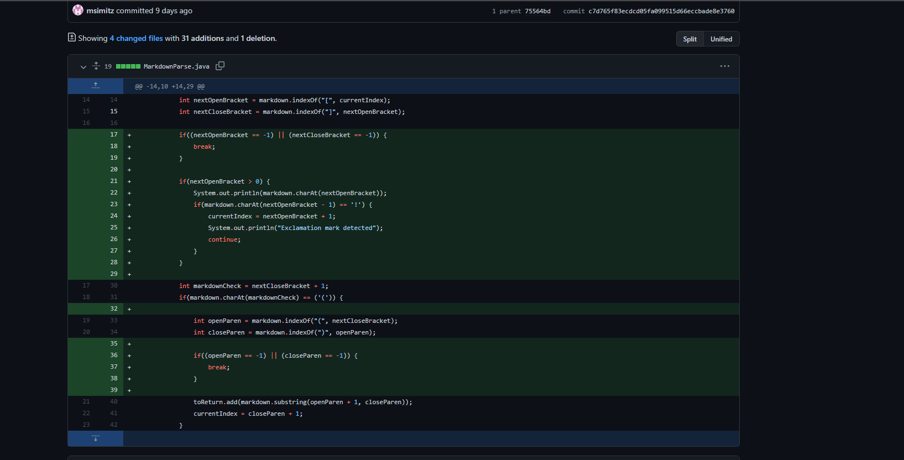

  Lab Report 2 Week 4

# Change #1 to fix a bug

* Screenshot of the code change diff from Github: 

* Link to the test file for a failure-inducing input that prompted you to make that change:
  * [test file #3](test-file3.md) contained the failure-inducing input. 

* Sympton of failure-inducing input by showing the output of running the file at the command line for version where it was failling: 

* Relationship between the bug, the symptom, and the failure-inducing input.
  * This bug was very intersting as it had multiple failure-inducing input: [test file #3](test-file3.md) and  [test file #4](test-file4.md). This bug which was that we did not have a checker to for empty brackets two different failure-inducing input which caused similar symptoms in each. For [test file #4](test-file4.md), the symptom was: 

# Change #2 to fix a bug

* Screenshot of the code change diff from Github: 

* Link to the test file for a failure-inducing input that prompted you to make that change:
  * [test file #6](test-file6.md) contained the failure-inducing input. 

* Sympton of failure-inducing input by showing the output of running the file at the command line for version where it was failling: 

* Relationship between the bug, the symptom, and the failure-inducing input.
  * explanation

# Change #3 to fix a bug

