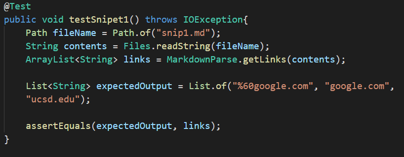
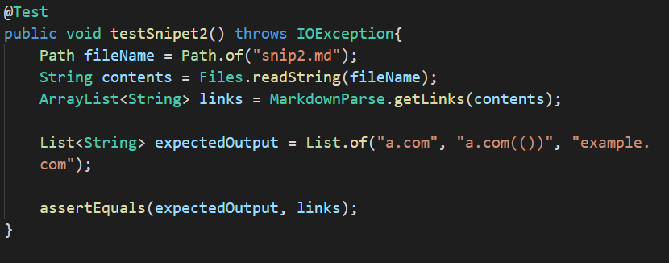
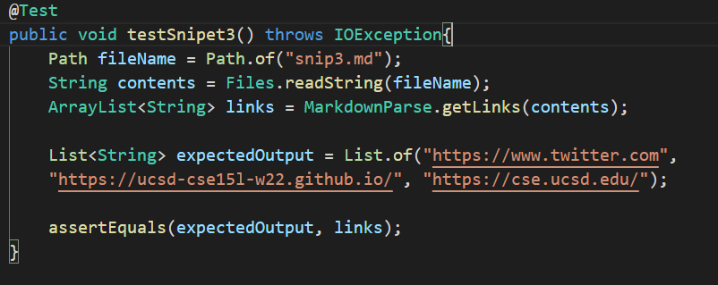

 <font size="12"> Lab Report 4 Week 8</font>

# Links
My mdp repo is: TODO ADD MINE

The mdp repo that I reviewed is: [https://github.com/Stocktocon/markdown-parse](https://github.com/Stocktocon/markdown-parse)


# Snippet 1:
* What it should produce:
  * This test should produce the links: "%60google.com", "google.com", and "ucsd.edu"
* How I turned this into a test:
  


* For my implementation:
  * The test failed and here is the specific part of the JUnit output that shows the test failure:

```
1) testSnipet1(MarkdownParseTest)
java.lang.AssertionError: expected:<[%60google.com, google.com, ucsd.edu]> but was:<[url.com, `google.com, google.com]>
        at org.junit.Assert.fail(Assert.java:89)
        at org.junit.Assert.failNotEquals(Assert.java:835)
        at org.junit.Assert.assertEquals(Assert.java:120)
        at org.junit.Assert.assertEquals(Assert.java:146)
        at MarkdownParseTest.testSnipet1(MarkdownParseTest.java:72)
```

* For the implementation I reviewed:
  * The test failed and here is the specific part of the JUnit output that shows the test failure:

```
1) testSnipet1(MarkdownParseTest)
java.lang.AssertionError: expected:<[%60google.com, google.com, ucsd.edu]> but was:<[url.com, `google.com, google.com, ucsd.edu]>
        at org.junit.Assert.fail(Assert.java:89)
        at org.junit.Assert.failNotEquals(Assert.java:835)
        at org.junit.Assert.assertEquals(Assert.java:120)
        at org.junit.Assert.assertEquals(Assert.java:146)
        at MarkdownParseTest.testSnipet1(MarkdownParseTest.java:116)
```

# Snippet 2:
* What it should produce:
  * This test should produce the links: "a.com", "a.com(())", and "example.com"
* How I turned this into a test:
  


* For my implementation:
  * The test failed and here is the specific part of the JUnit output that shows the test failure:

```
2) testSnipet2(MarkdownParseTest)
java.lang.AssertionError: expected:<[a.com, a.com(()), example.com]> but was:<[a.com, a.com((]>
        at org.junit.Assert.fail(Assert.java:89)
        at org.junit.Assert.failNotEquals(Assert.java:835)
        at org.junit.Assert.assertEquals(Assert.java:120)
        at org.junit.Assert.assertEquals(Assert.java:146)
        at MarkdownParseTest.testSnipet2(MarkdownParseTest.java:83)
```

* For the implementation I reviewed:
  * The test failed and here is the specific part of the JUnit output that shows the test failure:

```
2) testSnipet2(MarkdownParseTest)
java.lang.AssertionError: expected:<[a.com, a.com(()), example.com]> but was:<[a.com, b.com, a.com((, example.com]>
        at org.junit.Assert.fail(Assert.java:89)
        at org.junit.Assert.failNotEquals(Assert.java:835)
        at org.junit.Assert.assertEquals(Assert.java:120)
        at org.junit.Assert.assertEquals(Assert.java:146)
        at MarkdownParseTest.testSnipet2(MarkdownParseTest.java:127)
```

# Snippet 3:
* What it should produce:
  * This test should produce the links: "https://www.twitter.com", "https://ucsd-cse15l-w22.github.io/", and "https://cse.ucsd.edu/"
* How I turned this into a test:
  


* For my implementation:
  * The test failed and here is the specific part of the JUnit output that shows the test failure:

```
3) testSnipet3(MarkdownParseTest)
java.lang.AssertionError: expected:<[https://www.twitter.com, https://ucsd-cse15l-w22.github.io/, https://cse.ucsd.edu/]> but was:<[
    https://www.twitter.com
,
    https://ucsd-cse15l-w22.github.io/
, github.com

And there's still some more text after that.

[this link doesn't have a closing parenthesis for a while](https://cse.ucsd.edu/


]>
        at org.junit.Assert.fail(Assert.java:89)
        at org.junit.Assert.failNotEquals(Assert.java:835)
        at org.junit.Assert.assertEquals(Assert.java:120)
        at org.junit.Assert.assertEquals(Assert.java:146)
        at MarkdownParseTest.testSnipet3(MarkdownParseTest.java:94)
```

* For the implementation I reviewed:
  * The test failed and here is the specific part of the JUnit output that shows the test failure:

```
3) testSnipet3(MarkdownParseTest)
java.lang.AssertionError: expected:<[https://www.twitter.com, https://ucsd-cse15l-w22.github.io/, https://cse.ucsd.edu/]> but was:<[
    https://www.twitter.com
,
    https://ucsd-cse15l-w22.github.io/
, github.com

And there's still some more text after that.

[this link doesn't have a closing parenthesis for a while](https://cse.ucsd.edu/


, https://cse.ucsd.edu/


]>
        at org.junit.Assert.fail(Assert.java:89)
        at org.junit.Assert.failNotEquals(Assert.java:835)
        at org.junit.Assert.assertEquals(Assert.java:120)
        at org.junit.Assert.assertEquals(Assert.java:146)
        at MarkdownParseTest.testSnipet3(MarkdownParseTest.java:138)
```


# Answer the following questions with 2-3 sentences each:

* Do you think there is a small (<10 lines) code change that will make your program work for snippet 1 and all related cases that use inline code with backticks? If yes, describe the code change. If not, describe why it would be a more involved change.
        
        TYPE ANSWER HERE

* Do you think there is a small (<10 lines) code change that will make your program work for snippet 2 and all related cases that nest parentheses, brackets, and escaped brackets? If yes, describe the code change. If not, describe why it would be a more involved change.

        TYPE ANSWER HERE

* Do you think there is a small (<10 lines) code change that will make your program work for snippet 3 and all related cases that have newlines in brackets and parentheses? If yes, describe the code change. If not, describe why it would be a more involved change.

        TYPE ANSWER HERE
