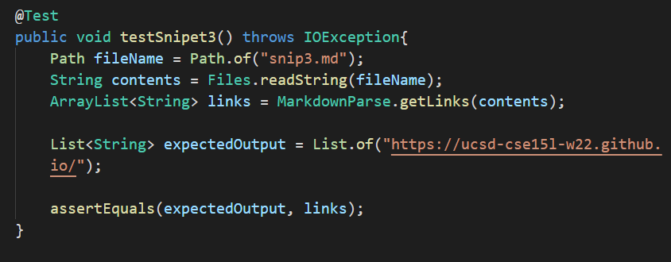

 <font size="12"> Lab Report 4 Week 8</font>

# Links
[My mdp repo](https://github.com/avVergnet/markdown-parse)

[The mdp repo that I reviewed](https://github.com/Stocktocon/markdown-parse)

Testing these snips:\
[snip1](snip1.md)\
[snip2](snip2.md)\
[snip3](snip3.md)


# Snippet 1:
* What it should produce:
  * This test should produce the links: "%60google.com", "google.com", and "ucsd.edu"
* How I turned this into a test:
  


* For my implementation:
  * The test failed and here is the specific part of the JUnit output that shows the test failure:

```
1) testSnipet1(MarkdownParseTest)
java.lang.AssertionError: expected:<[%60google.com, google.com, ucsd.edu]> but was:<[url.com, `google.com, google.com]>
        at org.junit.Assert.fail(Assert.java:89)
        at org.junit.Assert.failNotEquals(Assert.java:835)
        at org.junit.Assert.assertEquals(Assert.java:120)
        at org.junit.Assert.assertEquals(Assert.java:146)
        at MarkdownParseTest.testSnipet1(MarkdownParseTest.java:72)
```

* For the implementation I reviewed:
  * The test failed and here is the specific part of the JUnit output that shows the test failure:

```
1) testSnipet1(MarkdownParseTest)
java.lang.AssertionError: expected:<[%60google.com, google.com, ucsd.edu]> but was:<[url.com, `google.com, google.com, ucsd.edu]>
        at org.junit.Assert.fail(Assert.java:89)
        at org.junit.Assert.failNotEquals(Assert.java:835)
        at org.junit.Assert.assertEquals(Assert.java:120)
        at org.junit.Assert.assertEquals(Assert.java:146)
        at MarkdownParseTest.testSnipet1(MarkdownParseTest.java:116)
```

# Snippet 2:
* What it should produce:
  * This test should produce the links: "a.com", "a.com(())", and "example.com"
* How I turned this into a test:
  


* For my implementation:
  * The test failed and here is the specific part of the JUnit output that shows the test failure:

```
2) testSnipet2(MarkdownParseTest)
java.lang.AssertionError: expected:<[a.com, a.com(()), example.com]> but was:<[a.com, a.com((]>
        at org.junit.Assert.fail(Assert.java:89)
        at org.junit.Assert.failNotEquals(Assert.java:835)
        at org.junit.Assert.assertEquals(Assert.java:120)
        at org.junit.Assert.assertEquals(Assert.java:146)
        at MarkdownParseTest.testSnipet2(MarkdownParseTest.java:83)
```

* For the implementation I reviewed:
  * The test failed and here is the specific part of the JUnit output that shows the test failure:

```
2) testSnipet2(MarkdownParseTest)
java.lang.AssertionError: expected:<[a.com, a.com(()), example.com]> but was:<[a.com, b.com, a.com((, example.com]>
        at org.junit.Assert.fail(Assert.java:89)
        at org.junit.Assert.failNotEquals(Assert.java:835)
        at org.junit.Assert.assertEquals(Assert.java:120)
        at org.junit.Assert.assertEquals(Assert.java:146)
        at MarkdownParseTest.testSnipet2(MarkdownParseTest.java:127)
```

# Snippet 3:
* What it should produce:
  * This test should produce the links: "https://www.twitter.com", "https://ucsd-cse15l-w22.github.io/", and "https://cse.ucsd.edu/"
* How I turned this into a test:
  


* For my implementation:
  * The test failed and here is the specific part of the JUnit output that shows the test failure:

```
3) testSnipet3(MarkdownParseTest)
java.lang.AssertionError: expected:<[https://ucsd-cse15l-w22.github.io/]> but was:<[
    https://www.twitter.com
, 
    https://ucsd-cse15l-w22.github.io/
, github.com

And there's still some more text after that.

[this link doesn't have a closing parenthesis for a while](https://cse.ucsd.edu/


]>
        at org.junit.Assert.fail(Assert.java:89)
        at org.junit.Assert.failNotEquals(Assert.java:835)
        at org.junit.Assert.assertEquals(Assert.java:120)
        at org.junit.Assert.assertEquals(Assert.java:146)
        at MarkdownParseTest.testSnipet3(MarkdownParseTest.java:94)
```

* For the implementation I reviewed:
  * The test failed and here is the specific part of the JUnit output that shows the test failure:

```
3) testSnipet3(MarkdownParseTest)
java.lang.AssertionError: expected:<[https://ucsd-cse15l-w22.github.io/]> but was:<[
    https://www.twitter.com
,
    https://ucsd-cse15l-w22.github.io/
, github.com

And there's still some more text after that.

[this link doesn't have a closing parenthesis for a while](https://cse.ucsd.edu/


, https://cse.ucsd.edu/


]>
        at org.junit.Assert.fail(Assert.java:89)
        at org.junit.Assert.failNotEquals(Assert.java:835)
        at org.junit.Assert.assertEquals(Assert.java:120)
        at org.junit.Assert.assertEquals(Assert.java:146)
        at MarkdownParseTest.testSnipet3(MarkdownParseTest.java:138)
```


# Answer the following questions with 2-3 sentences each:

* Do you think there is a small (<10 lines) code change that will make your program work for snippet 1 and all related cases that use inline code with backticks? If yes, describe the code change. If not, describe why it would be a more involved change.
        
_In my opinoin I could add a change in my program less than 10 lines that would fix the issue. In my program, the first line is recognized but shouldn't be and the opposite for the fourth line. The second line could be easily fixed by transforming the backticks with a %60. The first and fourth line are related and can be overcome by adding checkers for when a backtick is opened and when one is closed. If one is opened outside then closed inside the brackets, this would not count as a link but if one is opened inside and closed inside the brackets anything in the backticks should be counted as a string._

* Do you think there is a small (<10 lines) code change that will make your program work for snippet 2 and all related cases that nest parentheses, brackets, and escaped brackets? If yes, describe the code change. If not, describe why it would be a more involved change.

_For the second snip this one could also be fixed using less than 10 lines. My program had troubles with the second and third line of the snipet. These two issues can be fixed by adding a counter which increases when a bracket is opened and decreases when it is closed. If one of the type is closed when one of the other type was just opened, this should not make a link. This counter could be added for the brackets and the parenthesis._

* Do you think there is a small (<10 lines) code change that will make your program work for snippet 3 and all related cases that have newlines in brackets and parentheses? If yes, describe the code change. If not, describe why it would be a more involved change.

_For test snipet3, I am not sure that I can fix it in less than 10 lines. I would need to implement a checker that makes sure that if the closing paren or opening paren is not in the same line, it is not more than one line away. By that I mean that the closing paren can be one line under but not empty line then closing paren. I am not sure how I would be able to go about this but I think it in less than 10 lines it would be complicated._

