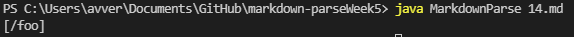
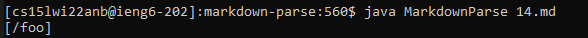

 <font size="12"> Lab Report 5 Week 10</font>

 * How you found the tests with different results (Did you use diff on the results of running a bash for loop? Did you search through manually? Did you use some other programmatic idea?)

I ran the bash: script.sh and manually looked at some test cases that looked interesting and could produce interesting debugging situations.

# Test 577
As I was looking throught the output of script.sh, I found that the test case 577 looked interesting. So I decided to test copy and paste the inside and put it in VS code so that I could use the preview to see how markdown rendred it. This is the inside:

```

```     

Markdown considers this as a picture because there is an exclamation mark in front of the link. Therefore the expected output is an empty arrayList.


The implementation provided to us previously considered this as a link and outputed:


My implementation has a exclamation mark checker and did not consider this as a link as it detected the exclamation mark. It outputed this:


In my code, there is an if statement in case the link is not the first code on the line. If it is not, my code check if there is an exclamation mark to handle pictures as they have a similar format to links in markdown. This can be fixed in the provided code by using a similar checker as the one I used in my own code which looks like this:


# Test 14

I beleive that this test case was to test the use of \ in markdown. The test contained

```
\*not emphasized*
\<br/> not a tag
\[not a link](/foo)
\`not code`
1\. not a list
\* not a list
\# not a heading
\[foo]: /url "not a reference"
\&ouml; not a character entity
```

When I put this in visual studio and used the preview feature to see if there was any links I found that \ cancels the links:


For this both my code and the given implementations failed.
My code returned:



The given code returned: 



Both of these outputs are incorrect as they do not match with the expected output from the preview in visual studio code. The fix for this bug is simillar to the one above where we added an exclamation mark checker except this time we would add a backslash checker that cancels the fact that there is a link there.